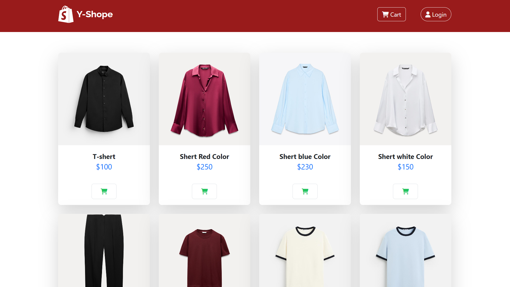

# React + Vite

<!-- To start the development server, run: npm run dev -->

This template provides a minimal setup to get React working in Vite with HMR and some ESLint rules.

## Getting Started

1. **Install dependencies:**

   ```bash
   npm install
2. **Start running:**

   ```bash
   npm run dev


### 🔗 Backend Repository

👉 [Backend GitHub Repo](https://github.com/harikrishnan2193/y_shope-backend)

### 🖼️ Screenshot



### 🚀 Live Demo

[Click here to try the live app](https://y-shope-frontend.vercel.app/)